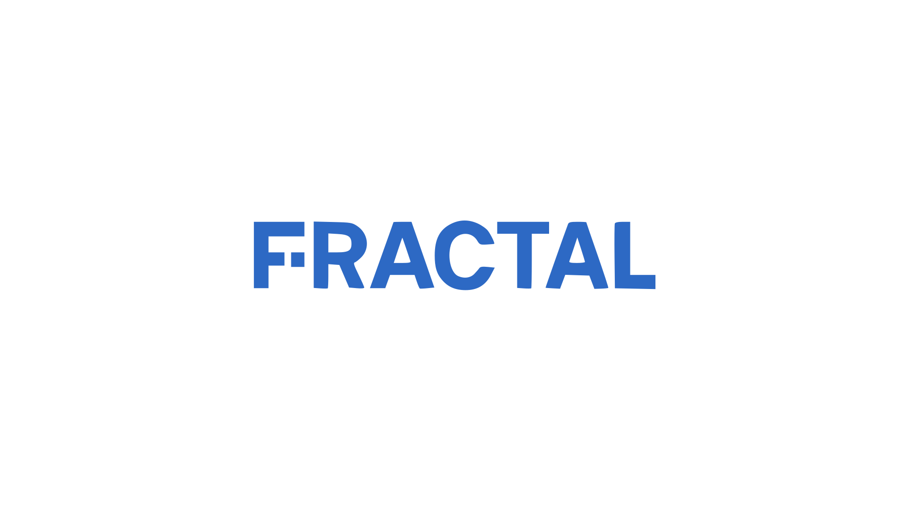

<p align="center">
  
</p>

<h1 align="center">Fractal SDK</h1>

<p align="center">A comprehensive toolkit for embedding interactive UIs in chat applications.</p>

<p align="center">
  <a href="https://github.com/fractal-mcp/sdk/actions"></a>
  <a href="https://www.npmjs.com/package/@fractal-mcp/oai-server"></a>
  <a href="https://nodejs.org/"></a>
  <a href="./LICENSE"></a>
  <a href="https://conventionalcommits.org"></a>
</p>

<p align="center">
Build rich, interactive widget applications using the <a href="https://modelcontextprotocol.io/">Model Context Protocol (MCP)</a> and cross-iframe messaging.
</p>

---

## Quick Start

### 1. Create a Widget UI Component

```tsx
// ui/WeatherWidget.tsx
import { useWidgetProps } from "@fractal-mcp/oai-hooks";

export default function WeatherWidget() {
  const props = useWidgetProps<{ location: string; temp: number }>();

  return (
    <div>
      <h2>{props.location}</h2>
      <p>{props.temp}°F</p>
    </div>
  );
}
```

### 2. Bundle the Widget

```bash
npx @fractal-mcp/cli bundle --entrypoint=./ui/WeatherWidget.tsx --out=./dist
```

This creates `dist/index.html` with your widget bundled as a single HTML file.

### 3. Create an MCP Server

```typescript
// server/index.ts
import { McpServer, registerOpenAIWidget, startOpenAIWidgetHttpServer } from "@fractal-mcp/oai-server";
import { z } from "zod";
import fs from "fs";

function createServer() {
  const server = new McpServer({ name: "weather-server", version: "1.0.0" });

  // Read bundled widget HTML
  const widgetHtml = fs.readFileSync("./dist/index.html", "utf-8");

  registerOpenAIWidget(
    server,
    {
      id: "get-weather",
      title: "Get Weather",
      description: "Show weather for a location",
      templateUri: "ui://widget/weather.html",
      invoking: "Fetching weather...",
      invoked: "Weather loaded!",
      html: widgetHtml,
      responseText: "Here's the weather",
      inputSchema: z.object({
        location: z.string().describe("City name")
      })
    },
    async (args) => ({
      content: [{ type: "text", text: `Weather in ${args.location}` }],
      structuredContent: {
        location: args.location,
        temp: 72
      }
    })
  );

  return server;
}

startOpenAIWidgetHttpServer({
  port: 8000,
  serverFactory: createServer
});
```

### 4. Run Your Server

```bash
npm run build
node dist/server/index.js
```

Your MCP server is now running at `http://localhost:8000` and ready to be connected to ChatGPT!

**Next steps:**
- [Full OpenAI Apps SDK quickstart](./docs/quickstart.md)
- [How It Works](./docs/how-it-works.md)
- [Package Reference](./docs/packages.md)

## What is this?

This SDK provides tools for embedding UIs in chat applications including:

- **[OpenAI Apps SDK](https://developers.openai.com/apps-sdk/)** - Build interactive widgets for ChatGPT
- **[MCP-UI Protocol](https://mcpui.dev/guide/embeddable-ui)** - Build embeddable UIs with cross-iframe messaging
- **Custom embedding solutions** - Use our messaging layer for any iframe-based UI embedding

The SDK makes it easier to:

- **Build MCP servers** with custom widget UIs
- **Create widget UI components** using React hooks
- **Embed UIs** using cross-iframe messaging protocols
- **Bundle and deploy** your widgets for production
- **Preview widgets** before deployment

This toolkit provides production-ready packages to start building today.

## Packages Overview

### OpenAI Apps SDK Packages
- **[@fractal-mcp/oai-hooks](./packages/oai-hooks)** - React hooks for building widget UIs (OpenAI Apps SDK)
- **[@fractal-mcp/oai-server](./packages/oai-server)** - Server toolkit for building MCP servers with widgets
- **[@fractal-mcp/oai-preview](./packages/oai-preview)** - Development tool for previewing widgets

### MCP-UI / Cross-iframe Messaging Packages
- **[@fractal-mcp/shared-ui](./packages/shared-ui)** - RPC layer for iframe communication
- **[@fractal-mcp/mcp-ui-messenger](./packages/mcp-ui-messenger)** - MCP-UI compatible iframe messenger
- **[@fractal-mcp/mcp-ui-hooks](./packages/mcp-ui-hooks)** - React hooks for MCP-UI messaging

### Bundling & Deployment
- **[@fractal-mcp/bundle](./packages/bundle)** - Bundling library for React components, JS/TS, and HTML files
- **[@fractal-mcp/cli](./packages/cli)** - Command-line tools for bundling widgets

### Server Utilities
- **[@fractal-mcp/mcp-express](./packages/mcp-express)** - Express utilities for serving MCP servers

**[View detailed package documentation](./docs/packages.md)**

## How It Works

### Data Flow

1. **User invokes tool** in ChatGPT
2. **Server handler** processes request and returns:
   - `content`: Text/resources for the chat
   - `structuredContent`: Props for the widget
3. **ChatGPT renders widget** using the bundled HTML
4. **Widget UI** receives props via `useWidgetProps()` and renders
5. **User interacts** with widget, state persists via `useWidgetState()`

### Package Relationships

```
┌──────────────────┐
│   oai-hooks      │  React hooks for widget UI
└────────┬─────────┘
         │ used by
         ↓
┌──────────────────┐
│   Your Widget    │  Your React components
└────────┬─────────┘
         │ bundled by
         ↓
┌──────────────────┐
│   bundle/cli     │  Bundling tools
└────────┬─────────┘
         │ produces HTML for
         ↓
┌──────────────────┐
│   oai-server     │  MCP server with widgets
└──────────────────┘
```

## Examples

Check out the [examples directory](./apps/examples) for complete working examples:

- **[oai-apps](./apps/examples/oai-apps)** - Full example showing server and UI integration

## Development

See [Development Guide](./docs/development.md) for setup instructions, testing, and contributing guidelines.

## Requirements

- Node.js 18+
- React 18+ (for widget UIs)
- TypeScript 5+ (recommended)

## Contributing

Contributions are welcome! Please feel free to submit issues or pull requests.

## License

Apache License, Version 2.0

## Resources

### OpenAI Apps SDK
- [OpenAI Apps SDK Documentation](https://developers.openai.com/apps-sdk/)
- [OpenAI Apps SDK Examples](https://github.com/openai/openai-apps-sdk-examples)

### MCP & MCP-UI
- [MCP-UI Embeddable UI Protocol](https://mcpui.dev/guide/embeddable-ui)
- [Model Context Protocol (MCP)](https://modelcontextprotocol.io/)
- [Fractal MCP](https://fractalmcp.com/)

## Credits

This SDK provides tools for embedding UIs in chat applications, supporting multiple protocols and frameworks. Special thanks to:

- **OpenAI** for pioneering the Apps SDK and widget approach to building interactive AI applications
- **[MCP-UI](https://mcpui.dev/)** for creating the embeddable UI protocol specification
- **[MCPJam Inspector](https://github.com/MCPJam/inspector)** for their excellent open-source MCP testing platform, which helped inform our development tooling
- The **MCP community** for building an ecosystem of tools and servers
